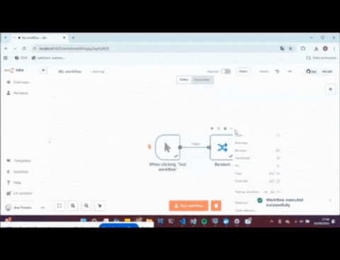
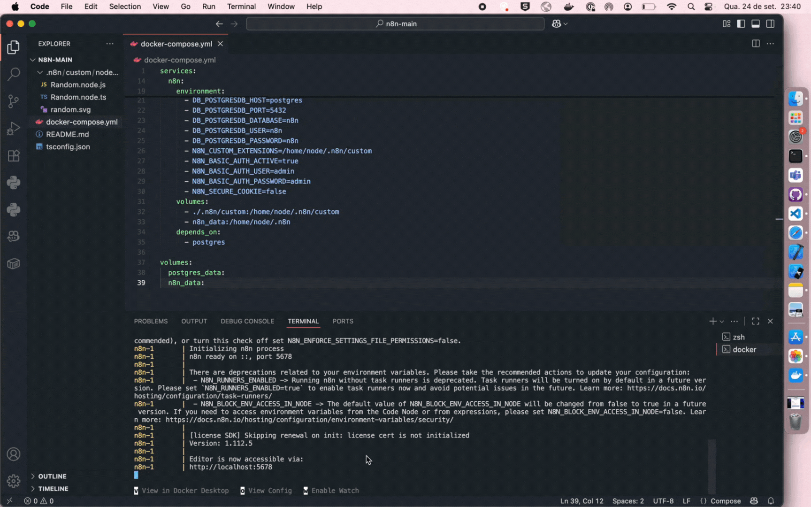

# n8n Custom Node: Random

## Descrição
Node customizado para o **n8n** que gera números aleatórios via **Random.org**, recebendo como input os valores mínimos e máximos (inteiros).

---

## Sumário
- Pré-requisitos  
- Por que Docker Compose?  
- Como rodar o projeto  
- Estrutura do Projeto  
- Como usar o node Random  
- Dificuldades e Desafios 
- Prints e exemplos  

---

## Pré-requisitos
- Docker Desktop 
- Git 
- OBS: Para rodar o projeto, **não é necessário** instalar Node.js ou TypeScript se você não for alterar o código do node. 

---

## Por que Docker Compose?

Apesar da abordagem para rodar nodes customizados localmente usando `npm link` e o n8n instalado via `npm`, optei por usar **Docker Compose** pelos seguintes motivos:

- Docker Compose é o método mais simples e padronizado para rodar o n8n localmente.
- Com Docker Compose, garanto que o ambiente será idêntico para qualquer pessoa que rodar o projeto, sem depender de versões específicas de Node.js, npm ou configurações locais do sistema operacional.  
- Não é preciso instalar o n8n globalmente, nem se preocupar com links simbólicos (`npm link`). Basta rodar `docker compose up` e tudo está pronto para uso.  

---

## Como rodar o projeto
1. Clone o repositório:

2. **Certifique-se de estar logado no Docker Hub:**
   - **Via Docker Desktop:** Abra o Docker Desktop e faça login pela interface gráfica
   - **Via terminal:** Execute `docker login` e insira suas credenciais do Docker Hub

3. Suba o Docker Compose:
docker compose up

3. Acesse o n8n: http://localhost:5678
O node Random já estará disponível no painel do n8n.

## Estrutura do Projeto
```
.n8n/
└── custom/
    └── nodes/
        └── Random/
            ├── Random.node.js # Código JavaScript compilado do node
            ├── Random.node.ts # Código TypeScript do node
            └── random.svg # Ícone SVG customizado
docker-compose.yml # Arquivo de configuração do Docker Compose
README.md # Documentação
tsconfig.json # Configuração do TypeScript
```


## Como usar o node Random
1. Crie um novo workflow no n8n.
2. Adicione o node Random.
3. Preencha os campos Min e Max (apenas inteiros).
4. Execute o node para obter um número aleatório entre os valores informados.

---

# Dificuldades e Desafios

## Uso do WSL no Windows
Durante a configuração do ambiente, enfrentei dificuldades para rodar o Docker no Windows devido a limitações do WSL. Inicialmente, utilizei o Debian na versão 1 do WSL, o que gerou incompatibilidades, erros de input/output e até corrupção da distribuição. Resolvi migrando para o Ubuntu e atualizando o WSL para a versão 2, o que permitiu rodar o Docker Compose de forma estável.

## Aprendizado prático com Docker
Este projeto exigiu que eu configurasse e utilizasse Docker e Docker Compose para orquestrar o ambiente do n8n. Foi necessário aprender na prática conceitos de containers, volumes e isolamento de ambiente, além de entender como o Docker facilita a replicação do ambiente de desenvolvimento.

## Cache de SVG no n8n
Ao substituir o ícone SVG do node, percebi que o n8n continuava exibindo o ícone antigo devido ao cache do navegador e do próprio container. A solução foi limpar o cache do navegador e reiniciar os containers, garantindo que o novo SVG fosse carregado corretamente.

## Exploração das tabelas do Postgres
Tive dificuldade inicial para entender a estrutura do banco de dados do n8n, especialmente sobre onde eram salvos workflows, execuções e credenciais. Para superar isso, utilizei o PGAdmin 4 para conectar ao banco Postgres do Docker Compose e rodei comandos SQL para explorar as tabelas e validar o funcionamento do node Random.

---

## Demonstração







